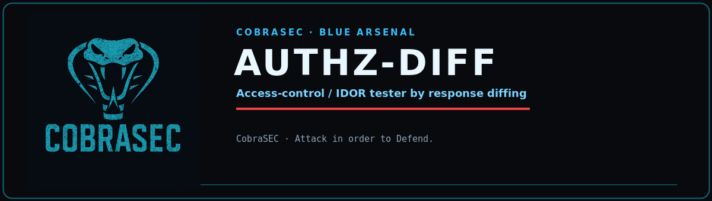

<p align="center">
  
</p>

<p align="center">
  
  
  
  
</p>

# authz-diff

Access-control / IDOR tester by response differencing.

Payload scanners find injection. They don't find the bug where the server
returns `200 OK` with the right data — to the wrong caller. `authz-diff` proves
that class: it replays **one captured request** (the object owner's) under other
identities and diffs what each one gets back.

- Another user's token gets the owner's data → **IDOR / BOLA**
- No token at all gets the owner's data → **missing authentication**
- Everyone else gets `401/403` → **correctly protected** (no finding)

Zero third-party dependencies. Standard library only.

## How it works

1. Send the request as captured — this is the **owner baseline** (2xx expected).
2. For each `--identity`, replace the auth-bearing headers (`Authorization`,
   `Cookie`, `X-Api-Key`, `X-Auth-Token`) with that identity's, resend.
3. An **unauth** identity (all auth headers stripped) is added automatically.
4. Diff each response against the owner baseline: status + body-similarity
   (`difflib` ratio) + length.

### Severity

| Verdict | Meaning |
|---|---|
| **CRITICAL** | unauthenticated request got a 2xx ≥95% identical to the owner's |
| **HIGH** | another identity got a 2xx ≥95% identical to the owner's (IDOR/BOLA) |
| **MEDIUM** | 2xx, 60–95% similar — accessible; check if it's the owner's data or its own |
| **LOW** | 2xx but a different body — likely the identity's own/empty data |
| **OK** | denied (401/403) — correctly protected |

Exit code `2` when any CRITICAL/HIGH is found (CI-friendly).

## Usage

```bash
# raw request file (paste from Burp) — baseline auth comes from the file
authz-diff -r owner_request.txt \
    --identity userB='Authorization: Bearer eyJ...'

# URL mode
authz-diff -u https://api.site.com/v2/orders/1042 \
    --header 'Authorization: Bearer OWNER' \
    --identity userB='Authorization: Bearer OTHER' \
    --identity staff='Cookie: session=abc'

# strip auth explicitly (NAME= with empty value); auto-added otherwise
authz-diff -r req.txt --identity nobody=

# sweep neighbouring object ids (replaced in URL + body)
authz-diff -r req.txt --identity userB='Authorization: Bearer B' \
    --swap 1042=1043,1044,1045

# self-signed / intercept proxy
authz-diff -r req.txt --identity userB='...' --no-verify -o result.json
```

## Raw request format (Burp-style)

```
GET /api/v2/orders/1042 HTTP/1.1
Host: api.site.com
Authorization: Bearer OWNER_TOKEN
Accept: application/json

```

Scheme defaults to `https` (override with `--scheme http`).

## Scope

Only replay requests against targets you are authorized to test. Supplying a
request is your assertion it is in scope.
